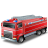

#  
РСиС (RSiSed)

Приложение предназначено для составления схем расстановки сил и средств при пожаре.
## License
**RSiSed** is free software: you can redistribute it and/or modify it under the terms of the GNU General Public License as published by the Free Software Foundation, either version 3 of the License, or (at your option) any later version. 
**RSiSed** is distributed in the hope that it will be useful, but WITHOUT ANY WARRANTY; without even the implied warranty of MERCHANTABILITY or FITNESS FOR A PARTICULAR PURPOSE. See the GNU General Public License for more details. 
You should have received a copy of the GNU General Public License along with this program. If not, see <https://www.gnu.org/licenses/>.
## Building
Requirements:
* QT 5.15.2  

You need to add the following dirrectories:
* bin/debug
* bin/profile
* bin/release
* build/debug
* build/profile
* build/release

In QtCreator, you need to disable shadow assembly for all configurations.

## Bug reports
[GitHub issues]( https://github.com/ViktorAH14/rsised/issues)
## Requests
[GitHub pull requests](https://github.com/ViktorAH14/rsised/pulls)

